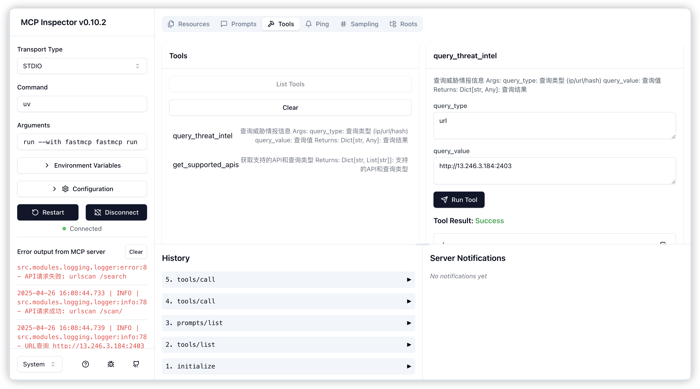
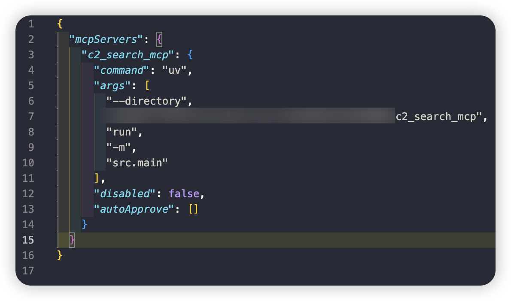
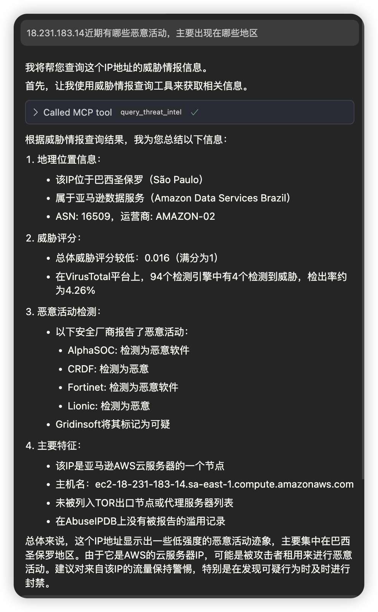
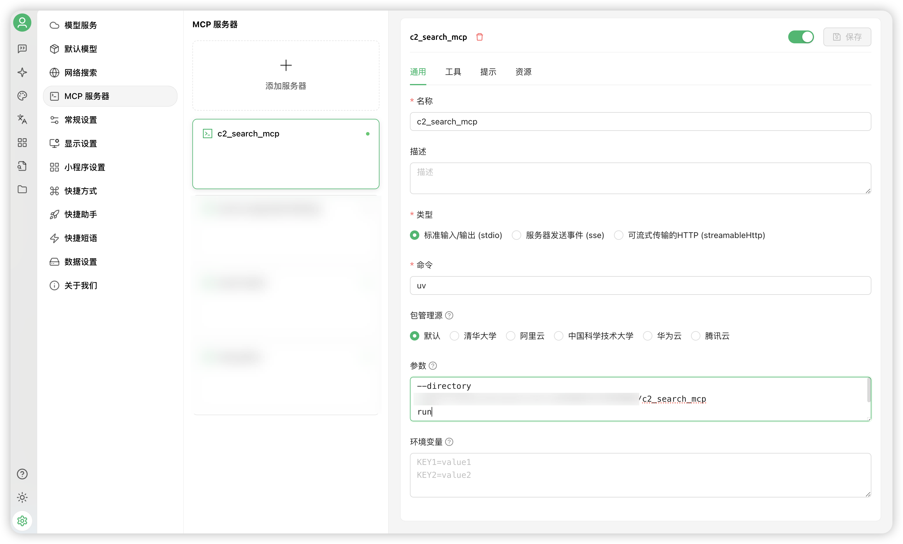
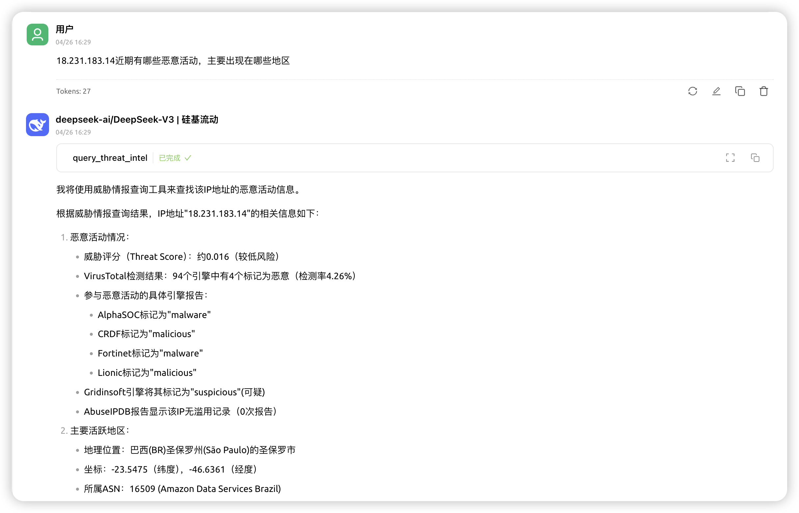

# 威胁情报集成查询服务

## 项目概述

本项目是基于FastMCP的威胁情报集成查询服务，支持查询IP地址、URL或文件哈希（MD5、SHA1、SHA256）等信息的威胁情报数据。该服务集成了多个威胁情报平台的API，为安全分析人员和系统管理员提供便捷的威胁情报查询功能，以提升威胁识别和响应的效率。

## 功能特点

- **多源数据整合**：集成VirusTotal、AbuseIPDB、微步在线等主流威胁情报平台
- **统一查询接口**：提供标准化的API接口，支持批量查询和自动化集成
- **高性能设计**：采用异步查询机制，支持并发请求处理
- **灵活扩展性**：模块化架构设计，易于集成新的情报源

## 安装说明

### 环境要求

- Python 3.12 或更高版本
- uv包管理工具

### 安装步骤

1. 克隆代码仓库
   ```bash
   git clone https://github.com/xuanyu123/c2_search_mcp.git
   cd c2_search_mcp
   ```

2. 安装uv（如果尚未安装）
   ```bash
   # Windows
   pip install uv
   
   # Linux/macOS
   curl -sSf https://github.com/astral-sh/uv/releases/latest/download/uv-installer.sh | bash
   ```

3. 使用uv同步开发环境（推荐）
   ```bash
   # 使用uv.lock文件同步依赖
   uv sync
   ```

4. 配置API密钥
   ```bash
   cp config.example.yaml config.yaml
   # 编辑config.yaml，填入各平台的API密钥
   ```

## 开发调试
### MCP Inspector调试

MCP Inspector是一个强大的调试工具，可以帮助您监控和调试MCP服务的运行状态。

1. 启动 Inspector
   ```bash
   fastmcp dev src/main.py
   ```
   或者直接npx运行
   ```bash
   npx @modelcontextprotocol/inspector uv run src/main.py
   ```

2. 访问调试界面
   - 打开浏览器访问 `http://localhost:port`（端口在控制台查看）
   - 在Inspector界面中可以看到所有注册的MCP服务
   

3. 调试功能
   - 实时监控服务状态
   - 查看请求/响应日志
   - 测试API接口
   - 查看性能指标

### 故障排除

1. 服务无法启动
   - 检查配置文件是否正确
   - 确认所有依赖已正确安装
   - 查看日志文件获取详细错误信息

2. API调用失败
   - 验证API密钥是否正确配置
   - 检查网络连接状态
   - 确认API请求限制是否超出

## 使用方法

#### 配置MCP服务
添加到您的 MCP 客户端配置文件，将"YOU_C2_SEARCH_MCP_DIR_PATH"替换为您自己的目录。

```bash
"c2_search_mcp": {
   "command": "uv",
   "args": [
      "--directory",
      "YOU_C2_SEARCH_MCP_DIR_PATH",
      "run",
      "-m",
      "src.main"
   ],
   "disabled": false,
   "autoApprove": []
}
```
### 使用示例
#### cursor集成
1. 配置mcp

2. cursor agent模式下，通过自然语言进行查询


#### Cherry Studio集成
1. 配置mcp

2. Cherry Studio agent模式下，通过自然语言进行查询


## 项目结构

```
c2_search_mcp/
├── src/                       # 源代码目录
│   ├── modules/               # 模块目录
│   │   ├── logging/           # 日志处理模块
│   │   ├── query_processor/   # 查询处理模块
│   │   ├── result_aggregator/ # 结果聚合模块
│   │   ├── threat_intel/      # 威胁情报API集成
│   ├── config.py              # 配置管理
│   ├── main.py                # 主程序入口
│   └── __init__.py            # 包初始化文件
├── tests/                     # 测试代码
├── docs/                      # 文档
├── config.example.yaml        # 配置文件示例
├── requirements.txt           # Python依赖项
├── pyproject.toml             # 项目配置文件
├── uv.lock                    # uv锁定文件，确保环境一致性
└── README.md                  # 项目说明文档
```

## 贡献指南

欢迎提交问题报告和功能请求。如果您想贡献代码，请遵循以下步骤：

1. Fork 项目仓库
2. 创建您的功能分支 (`git checkout -b feature/amazing-feature`)
3. 提交您的更改 (`git commit -m 'Add some amazing feature'`)
4. 推送到分支 (`git push origin feature/amazing-feature`)
5. 开启一个 Pull Request

## 许可证

本项目采用 MIT 许可证 - 详见 [LICENSE](LICENSE) 文件。 